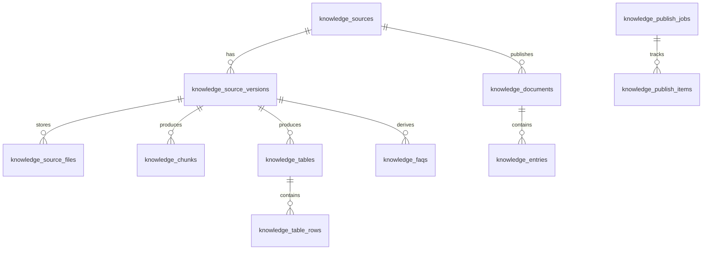

# Knowledge Database Design

Tai lieu nay mo ta `target database tables` cho he thong knowledge cua `IT - Smart - UTC`.

Muc tieu:
- bám theo schema da chot trong [data-schema-standard.md](D:/ITSmartAssistant_AdministrativeAgent/IT-Smart-Assistant/it_smart_assistant/docs/data-schema-standard.md)
- khong dap bo bang hien tai neu chua can
- cho phep mo rong thanh `production-lite` theo tung phase

## 1. Dinh huong thiet ke

He thong knowledge nen co 3 lop bang:

1. `source layer`
   - luu thong tin tai lieu goc, metadata, trang thai publish
2. `normalized layer`
   - luu text chunks, table rows, faq, interaction patterns, procedure/form templates
3. `runtime retrieval layer`
   - luu record da san sang cho search va embedding

Trong repo hien tai, bang:
- `knowledge_documents`
- `knowledge_entries`

da dong vai tro `runtime retrieval layer`.

Vi vay huong toi uu la:
- giu lai 2 bang nay
- bo sung `source + normalized tables`
- dung pipeline sync de day tu normalized layer sang runtime layer

## 2. Tong quan target tables

Bang de xuat:

- `knowledge_sources`
- `knowledge_source_versions`
- `knowledge_source_files`
- `knowledge_chunks`
- `knowledge_tables`
- `knowledge_table_rows`
- `knowledge_faqs`
- `knowledge_interactions`
- `knowledge_procedures`
- `knowledge_forms`
- `knowledge_publish_jobs`
- `knowledge_publish_items`
- `knowledge_documents`
- `knowledge_entries`

## 3. Bang hien tai giu lai

### 3.1. `knowledge_documents`

Trang thai: **giu lai**

Vai tro:
- snapshot document cho runtime retrieval
- truy nguoc ve source da publish

Nen tiep tuc dung cho:
- chatbot search runtime
- citation
- snapshot sau publish

Khuyen nghi bo sung sau:
- `source_id`
- `version_id`
- `trust_level`
- `effective_date`
- `expiry_date`

### 3.2. `knowledge_entries`

Trang thai: **giu lai**

Vai tro:
- record runtime de search
- luu embedding
- luu source_kind cho `chunk`, `table_row`, `faq`, `form_template`

Khuyen nghi bo sung sau:
- `source_id`
- `version_id`
- `status`
- `trust_level`
- `language`
- `published_at`

## 4. Source layer

### 4.1. `knowledge_sources`

Bang nay la “danh ba” nguon tri thuc.

```text
id uuid pk
source_id varchar(255) unique not null
source_type varchar(50) not null
title varchar(500) not null
category varchar(100) not null
subcategory varchar(100) null
source_office varchar(255) not null
trust_level varchar(50) not null
language varchar(20) not null
current_status varchar(50) not null
current_version_id uuid null
source_url text null
notes text null
created_at timestamptz not null
updated_at timestamptz null
```

Muc dich:
- 1 nguon co the co nhieu version
- 1 nguon co the den tu PDF, DOCX, Excel, FAQ, interaction log

### 4.2. `knowledge_source_versions`

Bang version theo van ban.

```text
id uuid pk
source_id uuid fk -> knowledge_sources.id
version_label varchar(100) null
issued_date date null
effective_date date null
expiry_date date null
status varchar(50) not null
checksum_sha256 varchar(128) null
is_active boolean not null default false
review_notes text null
reviewed_by uuid null
reviewed_at timestamptz null
created_at timestamptz not null
updated_at timestamptz null
```

Muc dich:
- phan biet ban dang co hieu luc va ban cu
- cho phep `published / archived / expired / replaced`

### 4.3. `knowledge_source_files`

Bang file vat ly.

```text
id uuid pk
source_version_id uuid fk -> knowledge_source_versions.id
file_name varchar(500) not null
file_type varchar(50) not null
storage_backend varchar(50) not null
storage_key text not null
relative_path text null
mime_type varchar(255) null
size_bytes bigint null
page_count int null
is_scanned boolean null
ocr_used boolean null
extractor varchar(100) null
quality_score numeric(5,2) null
created_at timestamptz not null
```

Muc dich:
- map file tren MinIO/local storage
- luu thong tin OCR va extractor

## 5. Normalized layer

### 5.1. `knowledge_chunks`

Cho PDF/DOCX text sections.

```text
id uuid pk
source_version_id uuid fk -> knowledge_source_versions.id
chunk_id varchar(255) unique not null
heading varchar(500) null
heading_level int null
section_title varchar(500) null
content text not null
summary text null
page_from int null
page_to int null
keywords jsonb not null default []
metadata_json jsonb not null default {}
status varchar(50) not null
created_at timestamptz not null
updated_at timestamptz null
```

Dung cho:
- quy che
- so tay sinh vien
- huong dan thu tuc

### 5.2. `knowledge_tables`

Bang metadata cua tung table extract duoc.

```text
id uuid pk
source_version_id uuid fk -> knowledge_source_versions.id
table_id varchar(255) unique not null
title varchar(500) not null
schema_type varchar(100) not null
page_from int null
page_to int null
headers jsonb not null default []
metadata_json jsonb not null default {}
status varchar(50) not null
created_at timestamptz not null
updated_at timestamptz null
```

Schema type vi du:
- `tuition_table`
- `deadline_table`
- `checklist_table`

### 5.3. `knowledge_table_rows`

Moi dong bang la mot record.

```text
id uuid pk
table_id uuid fk -> knowledge_tables.id
row_id varchar(255) not null
label varchar(500) null
row_order int not null
row_data jsonb not null
search_text text not null
track_tags jsonb not null default []
basis_tags jsonb not null default []
page_from int null
page_to int null
status varchar(50) not null
created_at timestamptz not null
updated_at timestamptz null
unique(table_id, row_id)
```

Dung cho:
- hoc phi
- cac bang lookup co cau truc

### 5.4. `knowledge_faqs`

```text
id uuid pk
faq_id varchar(255) unique not null
source_version_id uuid null fk -> knowledge_source_versions.id
question text not null
answer text not null
category varchar(100) not null
subcategory varchar(100) null
keywords jsonb not null default []
trust_level varchar(50) not null
status varchar(50) not null
source_url text null
last_reviewed_at timestamptz null
reviewed_by uuid null
created_at timestamptz not null
updated_at timestamptz null
```

### 5.5. `knowledge_interactions`

```text
id uuid pk
interaction_id varchar(255) unique not null
channel varchar(100) not null
occurred_at timestamptz null
user_question_raw text null
user_question_clean text not null
resolved_answer_clean text not null
intent varchar(50) not null
category varchar(100) not null
subcategory varchar(100) null
quality_label varchar(50) not null
contains_private_data boolean not null default false
review_status varchar(50) not null
reviewed_by uuid null
notes text null
created_at timestamptz not null
updated_at timestamptz null
```

Rule:
- `contains_private_data = false` moi duoc publish

### 5.6. `knowledge_procedures`

```text
id uuid pk
procedure_id varchar(255) unique not null
title varchar(500) not null
category varchar(100) not null
keywords jsonb not null default []
eligibility jsonb not null default []
required_documents jsonb not null default []
steps jsonb not null default []
contact_office varchar(255) null
related_form_id uuid null
source_ids jsonb not null default []
status varchar(50) not null
trust_level varchar(50) not null
created_at timestamptz not null
updated_at timestamptz null
```

### 5.7. `knowledge_forms`

```text
id uuid pk
form_id varchar(255) unique not null
title varchar(500) not null
category varchar(100) not null
description text null
keywords jsonb not null default []
fields jsonb not null default []
print_template_type varchar(100) not null
related_procedure_id uuid null
source_ids jsonb not null default []
status varchar(50) not null
created_at timestamptz not null
updated_at timestamptz null
```

## 6. Publish layer

### 6.1. `knowledge_publish_jobs`

Theo doi moi dot ingest / publish.

```text
id uuid pk
job_type varchar(50) not null
triggered_by uuid null
status varchar(50) not null
started_at timestamptz not null
completed_at timestamptz null
summary text null
stats_json jsonb not null default {}
```

### 6.2. `knowledge_publish_items`

Theo doi item nao duoc dua vao runtime.

```text
id uuid pk
publish_job_id uuid fk -> knowledge_publish_jobs.id
source_version_id uuid null
normalized_kind varchar(50) not null
normalized_record_id uuid not null
published_document_id uuid null fk -> knowledge_documents.id
published_entry_id uuid null fk -> knowledge_entries.id
status varchar(50) not null
notes text null
created_at timestamptz not null
```

## 7. Runtime retrieval layer

### 7.1. `knowledge_documents`

Bang snapshot runtime.

Mapping:
- 1 `knowledge_source_version` publish ra 1 hoac nhieu `knowledge_documents`

### 7.2. `knowledge_entries`

Bang retrieval runtime.

Mapping:
- `knowledge_chunks` -> `source_kind=document_chunk`
- `knowledge_table_rows` -> `source_kind=table_row`
- `knowledge_faqs` -> `source_kind=faq_entry`
- `knowledge_procedures` -> `source_kind=procedure_template`
- `knowledge_forms` -> `source_kind=form_template`
- `knowledge_interactions` -> `source_kind=interaction_pattern`

## 8. Quan he de xuat



## 9. Mapping tu schema du lieu sang DB

### PDF/DOCX
- `Common Source Metadata` -> `knowledge_sources`, `knowledge_source_versions`, `knowledge_source_files`
- `sections` -> `knowledge_chunks`
- `tables` -> `knowledge_tables`, `knowledge_table_rows`

### Excel
- `Common Source Metadata` -> `knowledge_sources`, `knowledge_source_versions`, `knowledge_source_files`
- `sheets` -> `knowledge_tables`
- `rows` -> `knowledge_table_rows`

### FAQ
- record -> `knowledge_faqs`

### Interaction
- record -> `knowledge_interactions`

### Procedure template
- record -> `knowledge_procedures`

### Form template
- record -> `knowledge_forms`

## 10. Chi muc quan trong

Nen co index cho:

### `knowledge_sources`
- `source_id`
- `category`
- `current_status`

### `knowledge_source_versions`
- `(source_id, is_active)`
- `status`
- `effective_date`

### `knowledge_chunks`
- `source_version_id`
- `status`

### `knowledge_tables`
- `source_version_id`
- `schema_type`

### `knowledge_table_rows`
- `table_id`
- `status`

### `knowledge_faqs`
- `category`
- `status`

### `knowledge_interactions`
- `intent`
- `category`
- `review_status`

### `knowledge_entries`
- `document_id`
- `source_kind`
- `category`
- `embedding` vector index sau nay

## 11. Khuyen nghi migration theo phase

Khong nen nhay thang vao full schema. Nen di theo 3 phase.

### Phase 1
Bo sung source layer toi thieu:
- `knowledge_sources`
- `knowledge_source_versions`
- `knowledge_source_files`

Va map tu Knowledge Admin upload vao day.

### Phase 2
Bo sung normalized layer:
- `knowledge_chunks`
- `knowledge_tables`
- `knowledge_table_rows`
- `knowledge_faqs`
- `knowledge_procedures`
- `knowledge_forms`

### Phase 3
Bo sung publish tracking:
- `knowledge_publish_jobs`
- `knowledge_publish_items`

## 12. De xuat thuc thi tren repo hien tai

Voi repo hien tai, huong dung nhat la:

1. giu `knowledge_documents` va `knowledge_entries`
2. them source layer truoc
3. refactor `knowledge_admin` de ghi vao source layer
4. refactor `ingest` de ghi vao normalized layer
5. refactor `knowledge_sync` de publish normalized layer -> runtime layer

## 13. Bang uu tien nen code truoc

Neu trien khai ngay, nen bat dau tu 6 bang:

1. `knowledge_sources`
2. `knowledge_source_versions`
3. `knowledge_source_files`
4. `knowledge_chunks`
5. `knowledge_tables`
6. `knowledge_table_rows`

Day la bo bang tao ra gia tri lon nhat cho:
- PDF/DOCX
- Excel
- knowledge admin
- retrieval

## 14. Ket luan

Target DB design nen theo huong:
- `source of truth` o source + normalized tables
- `runtime search` o knowledge snapshot tables

Dieu nay giup he thong:
- de review
- de publish/unpublish
- de tracking version
- de nang cap retrieval
- de lam analytics theo nguon du lieu
